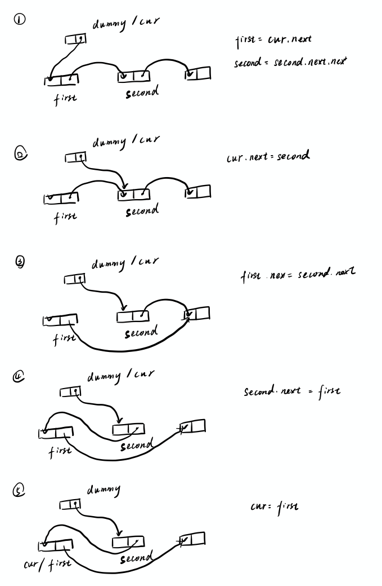
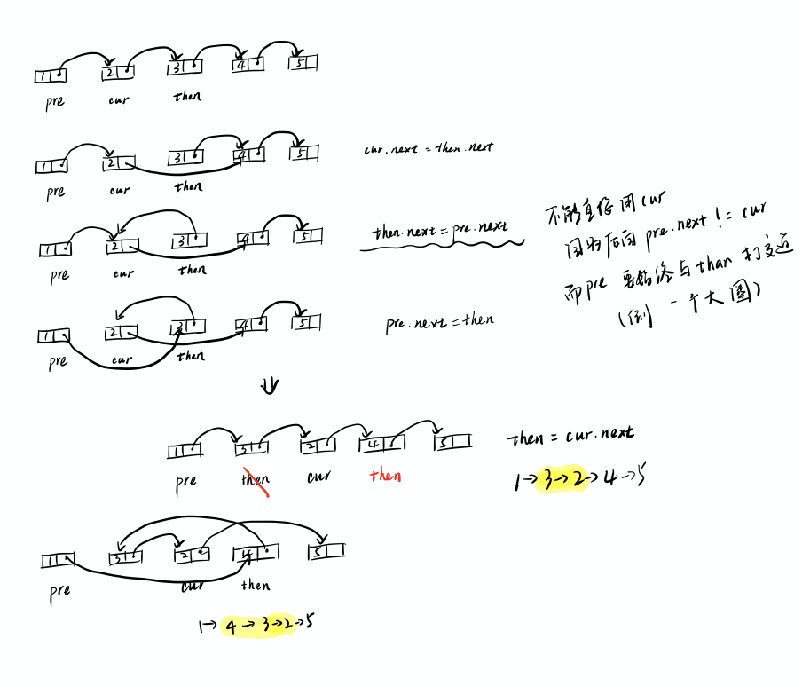
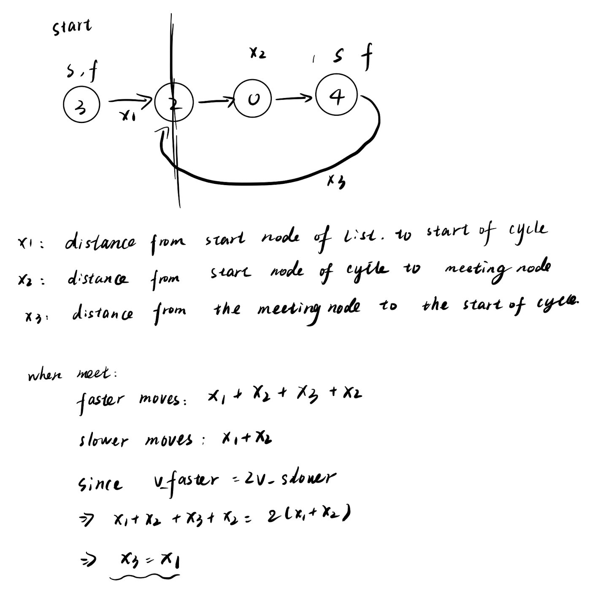

# Linked List

## Content


## Summary


## LeetCode Questions

### [2. Add Two Numbers (Medium)](https://leetcode.com/problems/add-two-numbers/)

**Solution**

* Time complexity: `O(max(len(l1), len(l2)))`
* Space complexity: `O(max(len(l1), len(l2)))`

```python
class Solution:
    def addTwoNumbers(self, l1: ListNode, l2: ListNode) -> ListNode:
        p1, p2, dummy = l1, l2, ListNode(-1)
        cur, carry = dummy, 0
        while p1 or p2 or carry: #注意carry（省去在while loop后还需要if carry的麻烦）
            p1_val = p1.val if p1 else 0
            p2_val = p2.val if p2 else 0
            s = p1_val + p2_val + carry
            carry, out = divmod(p1_val + p2_val + carry, 10)
            cur.next = ListNode(out)
            cur = cur.next
            p1 = p1.next if p1 else None
            p2 = p2.next if p2 else None
            
        return dummy.next
```


**My Errors**

```python
class Solution:
    def addTwoNumbers(self, l1: ListNode, l2: ListNode) -> ListNode:
      	"""
      	[2,4,3]
				[5,6,4]
      	"""
        dummy, head, carry = ListNode(-1), None, 0
        dummy.next = head
        while l1 or l2:
            num1 = l1.val if l1 else 0
            num2 = l2.val if l2 else 0
            s = num1 + num2 + carry
            head = ListNode(s % 10)
            head = head.next
            carry = s // 10
            l1 = l1.next if l1 else None
            l2 = l2.next if l2 else None
        return dummy.next
```

`dummy.next` 只记得它指向了`head`所指向的东西。第一次`head`指针指向None，`dummy`只记得它指向了`None`. 后面更新`head`，`dummy`并不会care。所以必须更新`dummy`本身或者`dummy.next`

* Example

  ```python
  class a_class:
      def __init__(self, number): 
          self.number = number
  
  
  a = a_class(1)
  print(a.number)
  b = a
  a = a_class(2)
  print(a.number)
  print(b.number)
  ```

  * output

    ```
    [charliefu]% python3 test.py
    1
    2
    1
    ```

  Since `b` only focus on what `a` points to, `b.number` will not change.


### [24. Swap Nodes in Pairs (Medium)](https://leetcode.com/problems/swap-nodes-in-pairs/)

**Solution**

> Iteration Version:

Time complexity: `O(n)`

Space complexity: `O(1)`

```python
class Solution:
    def swapPairs(self, head: ListNode) -> ListNode:
        """
        iteration
        """
        dummy = cur = ListNode(-1)
        dummy.next = head
        
        while cur and cur.next and cur.next.next: # only when there exists pairs
            first = cur.next
            second = cur.next.next
            cur.next = second
            first.next = second.next
            second.next = first
            cur = first
        return dummy.next
```

**Explanation**



> Recursive Version

* Time complexity: `O(n)`

* Space complexity: `O(n)`

```python
def swapPairs(self, head: ListNode) -> ListNode:
    """
      Recursion
    """
    if not head or not head.next:
      return head

    first = head.next
    head.next = self.swapPairs(head.next.next) # error: use self.swapPairs(head)
    first.next = head
    return first
```


**My Errors**

In recursive version, if we use `self.swapPairs(head)` for the example `head = [1,2,3,4]`, the recursive function would be `x.next = swap(x)`, which is infinite loop.


### [206. Reverse Linked List](https://leetcode.com/problems/reverse-linked-list/)

**Solution**

> Iteration

* Time complexity: `O(n)`
* Space complexity: `O(1)`

```python
class Solution:
    def reverseList(self, head: ListNode) -> ListNode:
        """
        method1: iteration
        """
        pre, cur = None, head
        while cur:
            tmp = cur.next
            cur.next = pre
            pre = cur
            cur = tmp
        return pre
```

**Explanation**


> Recursion

* Time complexity: `O(n)`
* Space complexity: `O(n)`

```python
class Solution:
    def reverseList(self, head: ListNode) -> ListNode:
        """
        method3: recursion
        """
        if not head or not head.next:
            return head

        cur = self.reverseList(head.next)
        head.next.next = head
        head.next = None
        return cur
```

**Explanation**


**Follow Ups**

[92. Reverse Linked List II](https://leetcode.com/problems/reverse-linked-list-ii/)

* Time complexity: `O(n)`
* Space complexity: `O(1)`

```python
# Definition for singly-linked list.
# class ListNode:
#     def __init__(self, val=0, next=None):
#         self.val = val
#         self.next = next
class Solution:
    def reverseBetween(self, head: ListNode, left: int, right: int) -> ListNode:
        # edge case
        if not head:
            return None
        
        # find left
        dummy = ListNode(-1)
        dummy.next = head
        pre, cur, i = dummy, dummy.next, 1
        while i < left and cur:
            pre = cur
            cur = cur.next
            i += 1
        
        if not cur: return head
        then = cur.next
        for _ in range(right - left):
            cur.next = then.next
            then.next = pre.next
            pre.next = then
            then = cur.next
        return dummy.next
```

**Explanation**



### [141. Linked List Cycle](https://leetcode.com/problems/linked-list-cycle/)

**Solution**

* Time complexity: `O(n)`
* Space complexity: `O(1)`

```python
class Solution:
    def hasCycle(self, head: ListNode) -> bool:
        if not head:
            return False
        
        slower, faster = head, head
        while faster.next and faster.next.next:
            slower = slower.next
            faster = faster.next.next
            if slower == faster:
                return True
        return False
```


**Explanation**

[Floyd's tortoise and hare](https://en.wikipedia.org/wiki/Cycle_detection#Tortoise_and_hare)


**Follow Ups**

[142. Linked List Cycle](https://leetcode.com/problems/linked-list-cycle-ii/)

**Solution**

* Time complexity: `O(n)`
* Space complexity: `O(1)`

```python
class Solution:
    def detectCycle(self, head: ListNode) -> ListNode:
        if not head:
            return None
        
        slower, faster = head, head
        while faster.next and faster.next.next:
            slower = slower.next
            faster = faster.next.next
            if slower == faster:
                tmp = head
                while tmp != slower:
                    tmp = tmp.next
                    slower = slower.next
                return tmp
        return None
```


**Explanation**




### [23. Merge k Sorted Lists](https://leetcode.com/problems/merge-k-sorted-lists/)

**Solution**

```python
class Solution:
    def mergeKLists(self, lists: List[ListNode]) -> ListNode:
        """
        divide and couquer
        """
        if not lists:
            return None
        n = len(lists)
        if n == 1:
            return lists[0]
        mid = n // 2
        l, r = self.mergeKLists(lists[:mid]), self.mergeKLists(lists[mid:])
        return self.merge(l, r)
    
    def merge(self, l, r):
        """
        merge two sorted list
        """
        dummy = ListNode(-1)
        cur = dummy # 更新dummy本身
        while l and r:
            if l.val < r.val:
                cur.next = ListNode(l.val)
                l = l.next
            else:
                cur.next = ListNode(r.val)
                r = r.next
            cur = cur.next
        cur.next = l or r
        return dummy.next 
```


### [147. Insertion Sort List](https://leetcode.com/problems/insertion-sort-list/)

**Solution**

* Time complexity: `O(n^2)`

* Space complexity: `O(1)`

```python
class Solution:
    def insertionSortList(self, head: ListNode) -> ListNode:
        """
        dummy = new ListNode(-1); //new starter of the sorted list (new head)
		    cur = head; //the node will be inserted
		    pre = dummy; //insert node between pre and pre.next
		    next = null; //the next node will be inserted
        """
        if not head:
            return None
        
        dummy = ListNode(-1)
        cur, pre, next_ = head, dummy, None
        while cur:
            next_ = cur.next # store next for the next loop
            
            # check the existing new list
            while pre.next and pre.next.val < cur.val:
                pre = pre.next
            
            # insert new node to the new list
            cur.next = pre.next
            pre.next = cur
            pre = dummy # update pre
            cur = next_ # update cur as the next node
        
        return dummy.next
```


**Explanation**

Don't try to do in-lines insertion, instead, we can create a new linked list.


**Follow ups**

compare different sorting algorithm of linked list.


[148. Sort List](https://leetcode.com/problems/sort-list/)

* time complexity: `O(nlogn)`
* space complexity: `O(logn)`

```python
class Solution:
    def sortList(self, head: ListNode) -> ListNode:
        if not head or not head.next:
            return head
        
        slower = faster = head
        while faster.next and faster.next.next:
            slower = slower.next
            faster = faster.next.next 
        mid = slower.next
        slower.next = None
        return self.merge(self.sortList(head), self.sortList(mid))
    
    def merge(self, l, r):
        dummy = cur = ListNode(-1)
        while l and r:
            if l.val < r.val:
                cur.next = ListNode(l.val)
                l = l.next
            else:
                cur.next = ListNode(r.val)
                r = r.next
            cur = cur.next
        cur.next = l or r
        return dummy.next
```


**my errors**

The base case for recursion is `not head or not head.next`. I forgot to consider `not head.next`, which results in endless recursion. 

